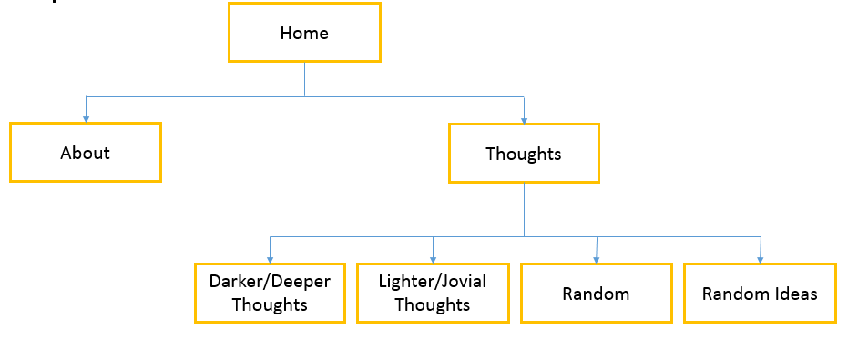
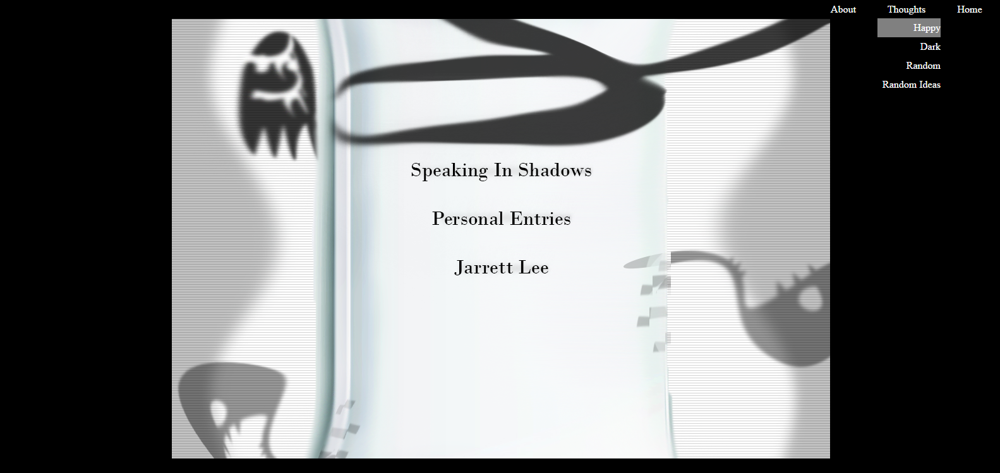
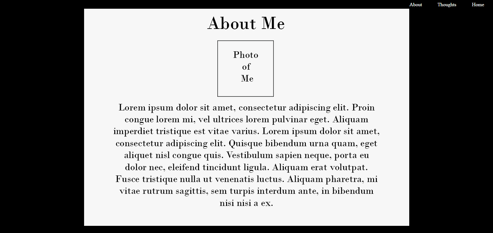
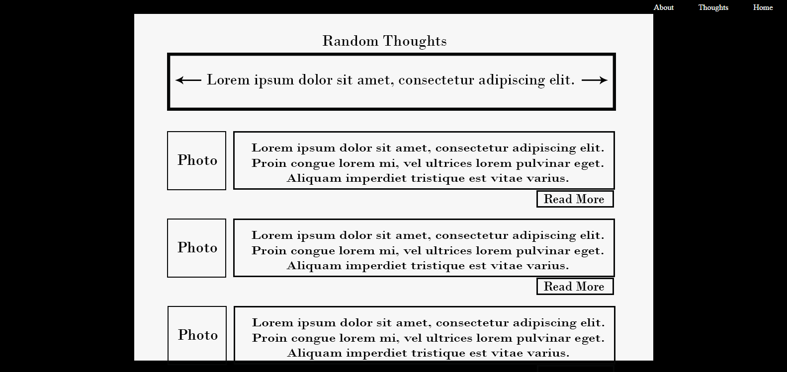

# **Prospective Midterm Plan**

##Concept
 Create a blog that voices deep/ unconventional thoughts 
 and ideas that people feel when they’re not at their best.
 As I learn to manipulate the UX more, I want to create a page 
 that allows for comments so that people may help one another 
 deal with the situations or concerns expressed.

## Site Map

## Wireframe / Conceptual

 

##Skills I've Learned
* Navigation bar
* Linking to other pages
* Divs
* Inline Block
* :Hover

##Skills I will Need
* Integrate JavaScript to run sprite scripts to create 2D graphics. 
* How to have text scroll horizontally within a defined spaced.
* Make words pan across the screen. 

##Inspiration
* http://www.gomoodboard.com/
	* Themes I took inspiration from
		* Bold and Black
		* Hip and Minimal

